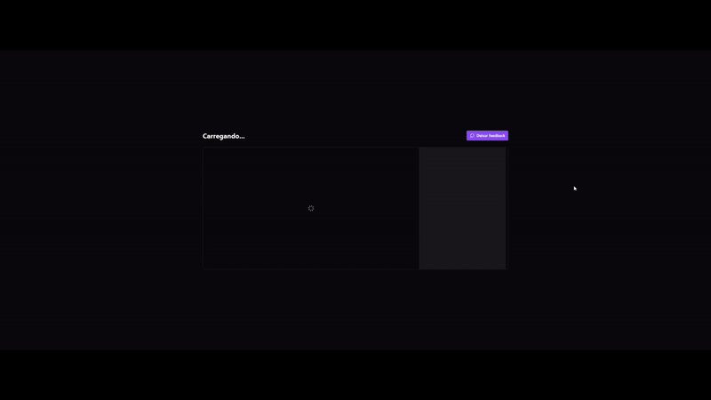

<h1 align="center">
  React Redux Zustand
</h1>

<p align="center">
 Este é um projeto de player de vídeo que demonstra a implementação de conceitos fundamentais de gerenciamento de estado com Redux e Zustand. O objetivo principal é fornecer um exemplo prático de como criar uma aplicação web robusta, controlando o estado da aplicação de maneira eficiente e testável.
</p>

<p align="center">
  <a href="#como-executar">ℹ️ Como Executar?</a>&nbsp;&nbsp;&nbsp;|&nbsp;&nbsp;&nbsp;
  <a href="#web">💻 Web</a>&nbsp;&nbsp;&nbsp;|&nbsp;&nbsp;&nbsp;
  <a href="#tecnologias">🚀 Tecnologias</a>&nbsp;&nbsp;&nbsp;
</p>

---

# Como Executar?

> Clone o Repositório:

Node version 18.16.0

Clone

```bash
git clone https://github.com/JonatanPaes/react-redux-zustand.git
```

Para executar o projeto utilizando Redux

```bash
cd player-redux
```

Para executar o projeto utilizando Zustand

```bash
cd player-zustand
```

Instale as dependências do projeto

```bash
npm install
```

# Web

Para executar o projeto

Execute o server

```sh
npm run server
```

Execute a aplicação

```sh
npm run dev
```

<p align="center">
  
</p>

# Tecnologias

- [Vite](https://vitejs.dev/)
- [React](https://react.dev/)
- [Redux](https://redux.js.org/)
- [React Redux](https://react-redux.js.org/)
- [Zustand](https://zustand-demo.pmnd.rs/)
- [Tailwind CSS](https://tailwindcss.com/)
- [Lucide](https://lucide.dev/guide/packages/lucide-react/)
- [React Player](https://github.com/CookPete/react-player)
- [Radix](https://www.radix-ui.com/)
- [Vitest](https://vitest.dev/)
- [JSON Server](https://github.com/typicode/json-server)
- [Axios](https://axios-http.com/)
